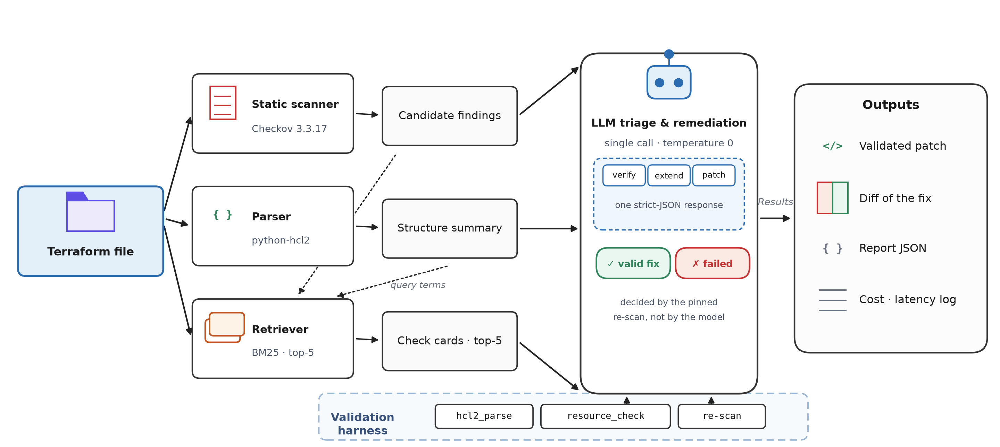

<div align="center">

# TerraSecRepair

**A Hybrid SAST and RAG Framework for Automated Infrastructure as Code
Security Analysis and Remediation**


*Scan → Retrieve → Repair → Validate. One call, one file, one verdict.*



[](https://github.com/user-attachments/assets/2be973a4-1538-438c-a2aa-96c3b2998344)

</div>

## Why

IaC scanners find thousands of cloud misconfigurations but fix none of them, and
LLMs asked to fix findings hallucinate rule identifiers, flag clean files, and
produce patches that look right while clearing nothing. TerraSecRepair grounds
the model instead:

1. **SAST anchoring** — Checkov 3.3.17 (pinned) produces candidate findings; the
   model must verify or refute each one and may add findings the scanner missed.
2. **RAG grounding** — BM25 retrieval over 595 scanner check cards; the model
   names the right rule and follows its documented remediation.
3. **Deterministic validation** — every patch is re-parsed, checked for resource
   preservation, and **re-scanned with the same pinned scanner**. A fix only
   counts when the target checks disappear and nothing new appears.

> The green/red verdict is decided by the re-scan, not by the model.

## Demo

A recorded playground session is included at [`docs/demo.mp4`](docs/demo.mp4) —
play it locally, or upload it once to a GitHub release and swap the link to
stream it directly in the README.

## Quick start

```bat
git clone https://github.com/<YOUR-USERNAME>/TerraSecRepair.git
cd TerraSecRepair
pip install -r requirements.txt
copy .env.example .env        & rem paste your OpenRouter key

python demo_audit.py examples\insecure_s3_public_access.tf --model qwen3.8-flash --mode hybrid
python -m streamlit run playground_app.py
```

- `demo_audit.py` audits any `.tf` file from the command line and prints the
  validation report.
- `playground_app.py` opens the interactive playground: pick a file or paste your
  own, choose any model/mode, compare conditions side by side.

Cost per new audit: **~$0.0003** (Qwen3.8-Flash / Llama-4-Maverick) to
**~$0.015** (GPT-5.6). Repeated runs are free — responses are cached by prompt
hash in `cache/`.

## Example

`examples/insecure_s3_public_access.tf` fails four Checkov checks
(CKV_AWS_53–56). The hybrid pipeline repairs it in one call:

```diff
  resource "aws_s3_bucket_public_access_block" "api_docs" {
    bucket                  = aws_s3_bucket.api_docs.id
+   block_public_acls       = true
+   block_public_policy     = true
+   ignore_public_acls      = true
-   restrict_public_buckets = false
+   restrict_public_buckets = true
  }
```

See [`examples/repaired_s3_public_access.tf`](examples/repaired_s3_public_access.tf)
for the full validated patch (4/4 targets eliminated, zero regressions).

## Configuration

| Variable | Purpose |
|---|---|
| `OPENROUTER_API_KEY` | OpenRouter key (`.env`); models: GPT-5.6, GPT-4o, Llama-4-Maverick, Qwen3.8-Flash |
| `assets/kb_cards.json` | Knowledge base: 595 scanner check cards (id, title, severity, guidance) |
| `cache/` | Prompt-hash response cache; makes every run replayable and free |

Checkov is **pinned at 3.3.17** — validation verdicts are only reproducible under
this version.

## Benchmark snapshot

| Metric | LLM only | Full hybrid |
|---|---|---|
| Finding-level F1 (best model) | 0.38 | **0.85** |
| Valid-fix rate (best model) | 36% | **61%** |
| False alarms on clean files | 31–61% | **6–39%** |
| Full 4×4×106 study cost | — | **$7.91** |

*Full methodology, ablations, and statistics in the accompanying manuscript.*

## Citation

If you use TerraSecRepair in your research, please cite the accompanying paper
(citation will be finalized upon publication):

```bibtex
@article{terrasecrepair,
  title  = {TerraSecRepair: A Hybrid SAST and RAG Framework for Automated Infrastructure as
            Code Security Analysis and Remediation},
  author = {},
  year   = {},
  note   = {Forthcoming}
}
```

## CI / merge gate (GitHub Actions)

The repo ships with a workflow (`.github/workflows/terrasecrepair-audit.yml`)
that runs the full hybrid pipeline on **every Terraform file changed in a pull
request**, posts the audit report as a PR comment and job summary, and **blocks
the merge while unvalidated `HIGH`+ findings remain** (configurable via
`--fail-on`).

One-time setup: add a repository secret `OPENROUTER_API_KEY` with your OpenRouter
key (Settings -> Secrets and variables -> Actions). Then open a PR touching any
`.tf` file and the audit job runs automatically.

Local dry run of the exact CI command:

```
python ci_audit.py --files examples/insecure_s3_public_access.tf --fail-on high
```

## License

[MIT](LICENSE)
